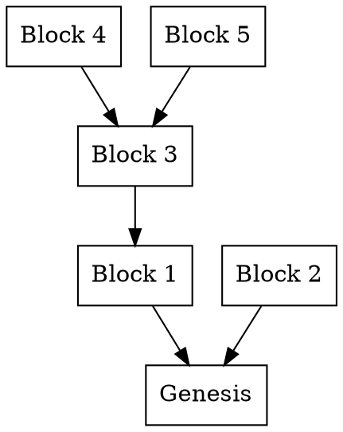

# Chapter 1

```dot process
digraph {
	node [shape=box];
    genesis [label = Genesis]
	b1 [label = "Block 1"]
	b2 [label = "Block 2"]
	b3 [label = "Block 3"]
	b4 [label = "Block 4"]
	b5 [label = "Block 5"]
	b5 -> b3
	b4 -> b3
	b3 -> b1
	b2 -> genesis
	b1 -> genesis
}
```
