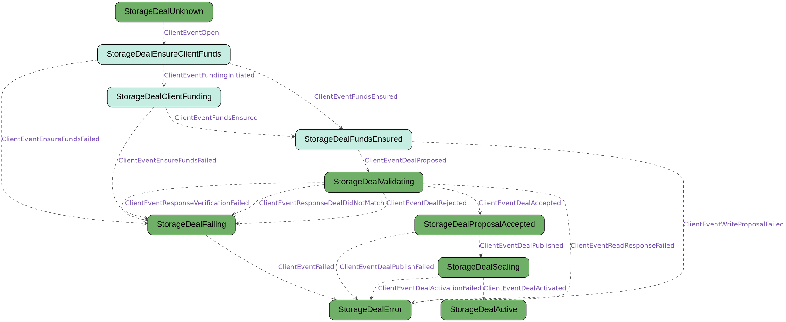
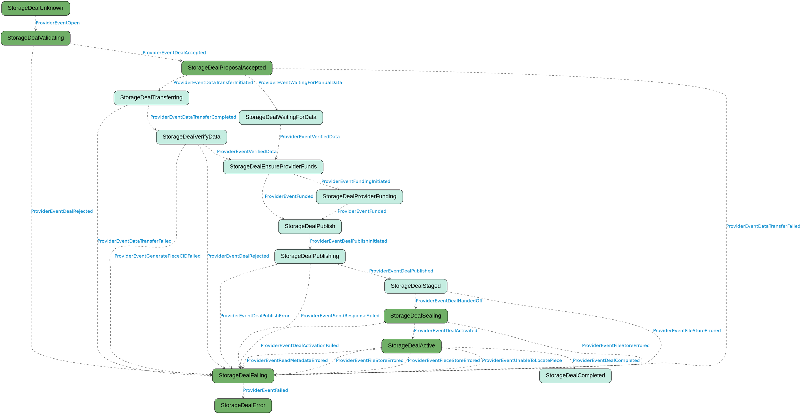

# go-fil-markets

## Client states

```dot process
digraph {
    node [ shape=record fontname="Arial" style="filled,rounded" fillcolor="#c5ede1" margin="0.3,0.2" fontsize=20];
    edge [ style=dashed fontname="Helvetica" color="#444444" fontcolor="#7F5AB6" arrowsize=0.75 arrowhead=vee fontsize=16];

    StorageDealUnknown [fillcolor="#70AF67"]
    StorageDealValidating [fillcolor="#70AF67"]
    StorageDealFailing [fillcolor="#70AF67"]
    StorageDealProposalAccepted [fillcolor="#70AF67"]
    StorageDealError [fillcolor="#70AF67"]
    StorageDealSealing [fillcolor="#70AF67"]
    StorageDealActive [fillcolor="#70AF67"]

    StorageDealUnknown -> StorageDealEnsureClientFunds [label="ClientEventOpen"]

    StorageDealEnsureClientFunds -> StorageDealClientFunding [label="ClientEventFundingInitiated"]

    StorageDealClientFunding -> StorageDealFailing [label="ClientEventEnsureFundsFailed"]
    StorageDealEnsureClientFunds -> StorageDealFailing [label="ClientEventEnsureFundsFailed"]

    StorageDealClientFunding -> StorageDealFundsEnsured [label="ClientEventFundsEnsured"]
    StorageDealEnsureClientFunds -> StorageDealFundsEnsured [label="ClientEventFundsEnsured"]

    StorageDealFundsEnsured -> StorageDealError [label="ClientEventWriteProposalFailed"]
    StorageDealFundsEnsured -> StorageDealValidating [label="ClientEventDealProposed"]

    StorageDealValidating -> StorageDealError [label="ClientEventReadResponseFailed"]
    StorageDealValidating -> StorageDealFailing [label="ClientEventResponseVerificationFailed"]
    StorageDealValidating -> StorageDealFailing [label="ClientEventResponseDealDidNotMatch"]
    StorageDealValidating -> StorageDealFailing [label="ClientEventDealRejected"]
    StorageDealValidating -> StorageDealProposalAccepted [label="ClientEventDealAccepted"]

    StorageDealProposalAccepted -> StorageDealError [label="ClientEventDealPublishFailed"]
    StorageDealProposalAccepted -> StorageDealSealing [label="ClientEventDealPublished"]

    StorageDealSealing -> StorageDealError [label="ClientEventDealActivationFailed"]
    StorageDealSealing -> StorageDealActive [label="ClientEventDealActivated"]
    StorageDealFailing -> StorageDealError [label="ClientEventFailed"]
}
```

## Provider states

```dot process
digraph G {
    node [ shape=record fontname="Arial" style="filled,rounded" fillcolor="#c5ede1" margin="0.3,0.2" fontsize=20];
    edge [ style=dashed fontname="Helvetica" color="#444444" fontcolor="#0088cc" arrowsize=0.75 arrowhead=vee fontsize=16];

    StorageDealUnknown [fillcolor="#70AF67"]
    StorageDealValidating [fillcolor="#70AF67"]
    StorageDealFailing [fillcolor="#70AF67"]
    StorageDealProposalAccepted [fillcolor="#70AF67"]
    StorageDealError [fillcolor="#70AF67"]
    StorageDealSealing [fillcolor="#70AF67"]
    StorageDealActive [fillcolor="#70AF67"]

    StorageDealUnknown -> StorageDealValidating [label="ProviderEventOpen"]

    StorageDealValidating -> StorageDealFailing [label="ProviderEventDealRejected"]
    StorageDealVerifyData -> StorageDealFailing [label="ProviderEventDealRejected"]

    StorageDealValidating -> StorageDealProposalAccepted [label="ProviderEventDealAccepted"]
    StorageDealProposalAccepted -> StorageDealWaitingForData [label="ProviderEventWaitingForManualData"]

    StorageDealProposalAccepted -> StorageDealFailing [label="ProviderEventDataTransferFailed"]
    StorageDealTransferring -> StorageDealFailing [label="ProviderEventDataTransferFailed"]

    StorageDealProposalAccepted -> StorageDealTransferring [label="ProviderEventDataTransferInitiated"]
    StorageDealTransferring -> StorageDealVerifyData [label="ProviderEventDataTransferCompleted"]

    StorageDealVerifyData -> StorageDealFailing [label="ProviderEventGeneratePieceCIDFailed"]
    StorageDealVerifyData -> StorageDealEnsureProviderFunds [label="ProviderEventVerifiedData"]
    StorageDealWaitingForData -> StorageDealEnsureProviderFunds [label="ProviderEventVerifiedData"]

    StorageDealEnsureProviderFunds -> StorageDealProviderFunding [label="ProviderEventFundingInitiated"]

    StorageDealProviderFunding -> StorageDealPublish [label="ProviderEventFunded"]
    StorageDealEnsureProviderFunds -> StorageDealPublish [label="ProviderEventFunded"]

    StorageDealPublish -> StorageDealPublishing [label="ProviderEventDealPublishInitiated"]

    StorageDealPublishing -> StorageDealFailing [label="ProviderEventDealPublishError"]
    StorageDealPublishing -> StorageDealFailing [label="ProviderEventSendResponseFailed"]
    StorageDealPublishing -> StorageDealStaged [label="ProviderEventDealPublished"]

    StorageDealStaged -> StorageDealFailing [label="ProviderEventFileStoreErrored"]
    StorageDealSealing -> StorageDealFailing [label="ProviderEventFileStoreErrored"]
    StorageDealActive -> StorageDealFailing [label="ProviderEventFileStoreErrored"]

    StorageDealStaged -> StorageDealSealing [label="ProviderEventDealHandedOff"]
    StorageDealSealing -> StorageDealFailing [label="ProviderEventDealActivationFailed"]
    StorageDealSealing -> StorageDealActive [label="ProviderEventDealActivated"]

    StorageDealActive -> StorageDealCompleted [label="ProviderEventDealCompleted"]
    StorageDealActive -> StorageDealFailing [label="ProviderEventPieceStoreErrored"]
    StorageDealActive -> StorageDealFailing [label="ProviderEventUnableToLocatePiece"]
    StorageDealActive -> StorageDealFailing [label="ProviderEventReadMetadataErrored"]

    StorageDealFailing -> StorageDealError [label="ProviderEventFailed" ]
}
```
